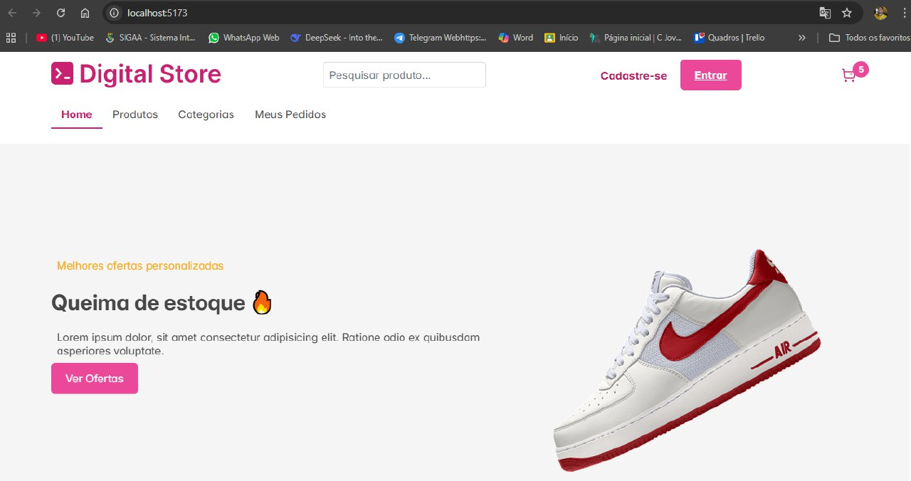

# Digital Store - Front-end



## Sobre o Projeto
Este projeto foi desenvolvido como parte do curso de **Desenvolvimento Web** na **Digital College**.  
O objetivo foi criar uma aplicação **Front-end completa** utilizando **React**, baseada no design disponível no [Figma](https://www.figma.com/design/cfb4F7ZXMFQmvmTn3PKI4z/DRIP-STORE---DIGITAL-COLLEGE?node-id=22-30) e na [documentação oficial do projeto Digital Store](https://github.com/digitalcollegebr/projeto-digital-store).  

A aplicação simula uma loja online, apresentando páginas de listagem e visualização de produtos, aplicando conceitos modernos de **componentização, roteamento, estilização e boas práticas de código**.  

------------------------------------------------------------------------------------------------

## Objetivos desse Trabalho
- Desenvolver uma aplicação web com React.
- Implementar as páginas principais:
  - **Página Inicial**
  - **Página de Listagem de Produtos**
  - **Página de Visualização do Produto**
- Seguir requisitos mínimos da documentação do projeto.
- Aplicar **boas práticas de desenvolvimento Front-end**.
- Criar funcionalidades para determinadas ações.
- Utilizar o uso de Hooks

-------------------------------------------------------------------------------------------------

## Tecnologias Utilizadas
- [React](https://react.dev/)  
- [React Router](https://reactrouter.com/)  
- [Styled Components](https://styled-components.com/)  
- [Vite](https://vitejs.dev/)
- Hooks, Props, UseContext, JavaScript, HTML/CSS.

-------------------------------------------------------------------------------------------------

## Pré-requisitos para Rodar o Projeto 
- Node.js instalado (versão 16+ recomendada)
- Gerenciador de pacotes (npm, yarn ou pnpm)

-------------------------------------------------------------------------------------------------


## Estrutura de Pastas
```plaintext
src/
├── assets/             # Imagens, ícones e recursos estáticos
├── components/         # Componentes reutilizáveis
│   ├── Header/
│   ├── ProductCard/
│   ├── ProductListing/
│   ├── CartCard.jsx
│   ├── CartModal.jsx
│   ├── FilterGroup.jsx
│   ├── Footer.jsx
│   ├── MySearch.jsx
│   ├── ProductGallery.jsx
│   └── Section.jsx
├── context/            # Context API para gerenciamento de estado
│   └── CartContext.jsx
├── layout/             # Layouts e componentes de interface
│   ├── airOffer.css
│   ├── airOffer.jsx
│   ├── CarouselNyke.jsx
│   └── Collections.jsx
├── pages/              # Páginas principais
│   ├── HomePage.jsx
│   ├── MyOrders.jsx
│   ├── ProductListingPage.jsx
│   └── ProductViewPage.jsx
├── routes/             # Definição de rotas e Outlet
│   └── routes.jsx
├── services/           # Serviços e integração com API/mocks
│   ├── CartService.js
│   ├── Data.js
│   └── PhotoService.jsx
├── styles/             # Estilos globais
├── App.jsx
├── App.css
├── index.css
├── main.jsx
└ index.html
```

### Passos para ter acesso ao Repositório
```bash
# Clone este repositório
git clone https://github.com/luiscarlo5/FrontEnd-G3.git

# Acesse a pasta do projeto
cd FrontEnd-G3

# Instale as dependências
npm install

# Execute em ambiente de desenvolvimento
npm run dev

# Acesse pelo navegador
http://localhost:3000
